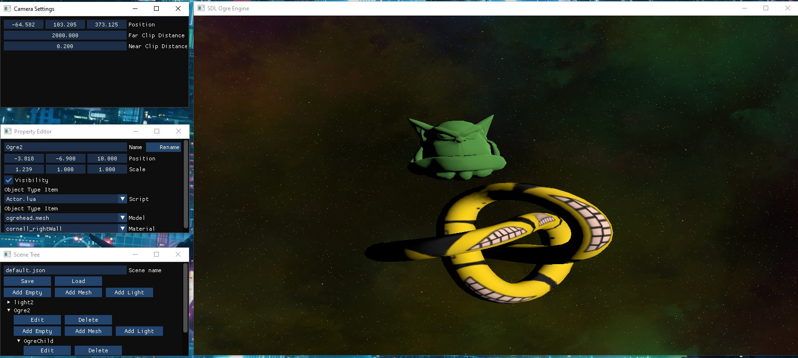
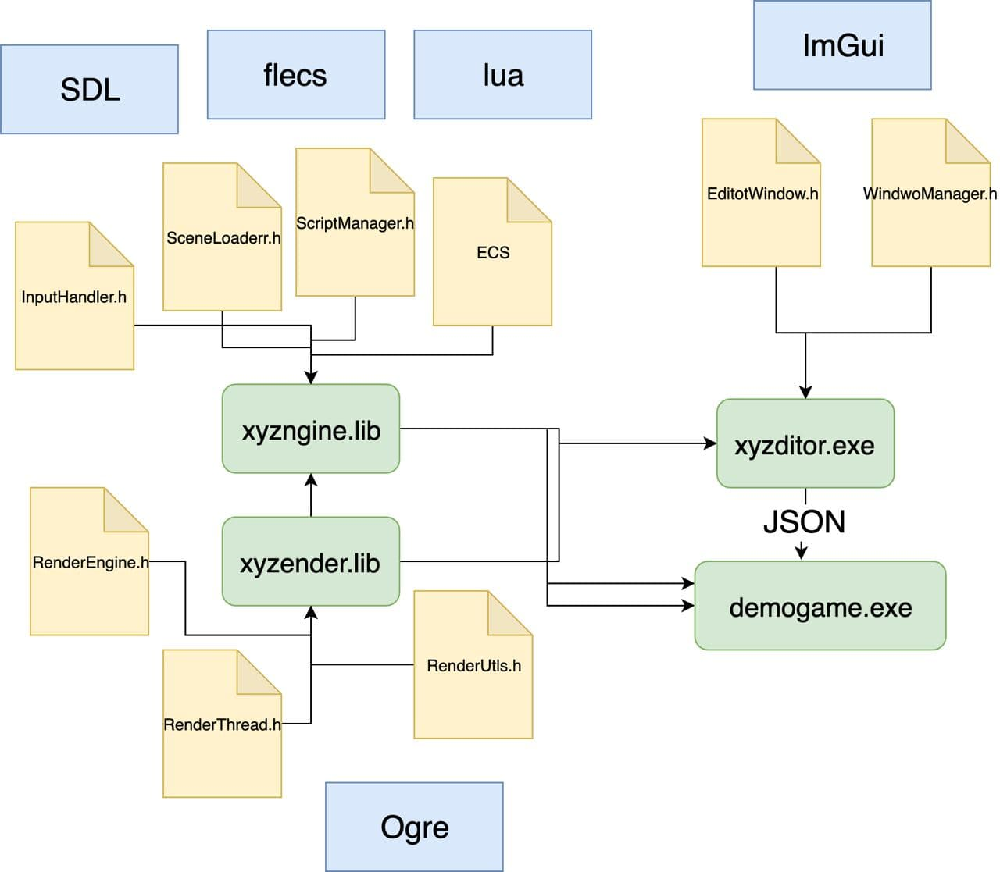

# xyzngine

# Import editor files locations

```Media/scripts``` - lua scripts. Include script for demogame with float in-game camera.

```Media/scenеs``` - scenes files in json. xyzditor saves files hehe by default.

```Media/models``` - ogre models.

```Media/actionmap.ini``` - actions to keys mapping. You can add yours.

# Workflow
1. Create scene in xyzditor
2. Write and add scripts to ```Media/scripts```
3. Set scripts for objects
4. Save to default.json
5. Run demogame.exe

# Editor
* Scene tree
* Camera settings
* Add or delete object (empty, mesh, light)
* Object property editor
  * Transforms
  * Scripts
  * Mesh
  * Materisl
* Load/Store
* Free float camera




# Scheme


